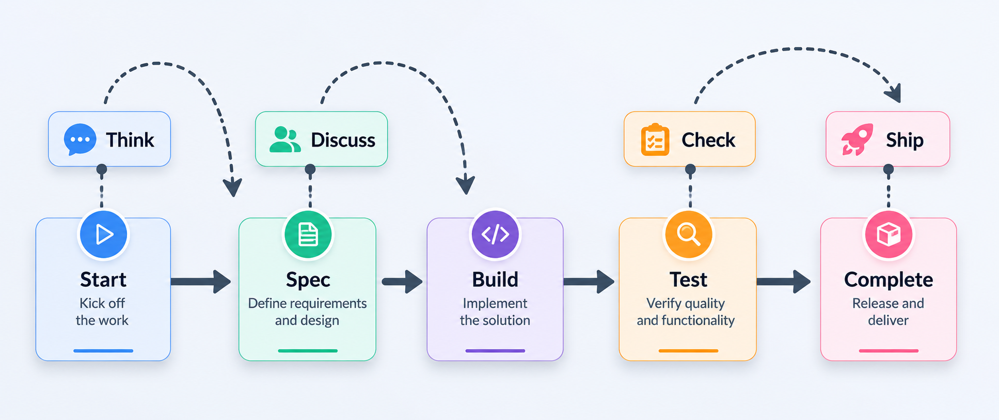

# BuildFlow

> From epic to ship — spec-driven, multi-agent AI development with epics, planning, build, test, debug, perf, security audit, and deploy — for Claude Code, Gemini CLI, Codex CLI, Cursor, Cline, and Continue.
> **v8.0** — Session continuity, epic templates, performance profiling, multi-agent execution, PR generation, database migration management, production observability, and OpenAPI generation from spec.

[](https://www.npmjs.com/package/buildflow-dev)
[](https://opensource.org/licenses/MIT)
[](https://nodejs.org)

---

## Table of Contents

- [What is BuildFlow?](#what-is-buildflow)
- [Quick Start](#quick-start)
- [Existing Codebases — Run Onboard First](#existing-codebases--run-onboard-first)
- [Supported AI Tools](#supported-ai-tools)
- [AI Slash Commands](#ai-slash-commands)
- [CLI Commands](#cli-commands)
- [Git Permission System](#git-permission-system)
- [No-Git Mode](#no-git-mode)
- [Spec Governance](#spec-governance)
- [Post-Ship Feature Advisor](#post-ship-feature-advisor)
- [How It Works](#how-it-works)
- [Package Source Structure](#package-source-structure)
- [The .buildflow/ Scaffold](#the-buildflow-scaffold)
- [Template System](#template-system)
- [9 Specialized Agents](#9-specialized-agents)
- [v7.0: What's New](#v70-whats-new)
- [Contributing](#contributing)
- [Publishing](#publishing)

---

## What is BuildFlow?

BuildFlow is a **CLI tool** that installs a spec-driven, multi-agent AI workflow into any project. It does two things:

1. **Scaffolds `.buildflow/`** — markdown files that act as persistent memory, formal specs, project state, and agent instructions
2. **Installs slash commands** — writes `/buildflow-*` command files into whichever AI tools you use (Claude Code, Cursor, Gemini CLI, etc.)

Once installed, you work entirely inside your AI tool using `/buildflow-*` commands.

**Five core ideas that separate BuildFlow from other tools:**

- **Spec-first:** Every epic starts with formal Requirements + Technical Design + Acceptance Criteria. Plans trace to ACs. Ship is blocked if any AC is unsatisfied.
- **Context isolation + resume:** Each agent receives a minimal context packet, and each epic keeps a compact `STATE.md` so fresh sessions can continue cleanly.
- **Auto-prune:** `MEMORY.md` is automatically compressed at session start and after each ship. Long sessions stay lean.
- **Cross-project intelligence:** Global learnings written at every milestone completion surface relevant insights in future projects using the same framework.

---

## Quick Start

```bash
# Run once in any project directory
npx buildflow-dev init
```

This will:
1. Detect your project (framework, language, existing code vs. greenfield)
2. Ask for your app name and experience level
3. **Ask for git permission** (approve / deny / deny permanently)
4. Create `.buildflow/` with memory, state, preferences, and agent config files
5. Detect which AI tools you have installed
6. Write `/buildflow-*` slash commands into each detected tool

Then open your AI tool and type `/buildflow-start-epic` to begin.

```bash
# Or install globally
npm install -g buildflow-dev
buildflow init
```

---

## Existing Codebases — Run Onboard First

If you're adding BuildFlow to an existing project, run this **once** before `/buildflow-start-epic`:

```
/buildflow-onboard
```

Runs five parallel analyses (architecture, quality, security, data, features) and writes 5 consolidated knowledge files to `.buildflow/codebase/`: `CODEBASE.md`, `PATTERNS.md`, `DEPENDENCIES.md`, `RISKS.md`, `TESTING.md`, and `intel.json` (symbol-level import graph + drift baseline). All subsequent commands load only the files they need — never the full codebase.

Codebase drift is automatically detected at every session start — schema changes, removed symbols, and large file count jumps surface as warnings before anything else runs.

---

## Supported AI Tools

| Tool | Auto-detect Method | Global Install Path | Local Install Path | Trigger |
|------|-------------------|--------------------|--------------------|---------|
| **Claude Code** | `claude` CLI or `~/.claude/` | `~/.claude/commands/buildflow-*.md` | `.claude/commands/buildflow-*.md` | `/buildflow-*` |
| **Gemini CLI** | `gemini` CLI | `~/.gemini/commands/*.md` + `GEMINI.md` | `.gemini/commands/*.md` + `GEMINI.md` | `/buildflow-*` |
| **Codex CLI** | `codex` CLI | `~/.codex/instructions/` + `skills/` | `.codex/instructions/` + `skills/` | `$buildflow-*` |
| **Cursor** | `~/.cursor/` or app dir | (falls back to local) | `.cursor/rules/buildflow.mdc` | `@buildflow-*` |
| **Cline** | VS Code extension `saoudrizwan.claude-dev` | (falls back to local) | `.clinerules` | `/buildflow-*` |
| **Continue** | `~/.continue/config.json` | `~/.continue/buildflow/*.md` + config patch | `.continue/buildflow/*.md` | `/buildflow-*` |

---

## AI Slash Commands

Installed into your AI tool and triggered by typing `/buildflow-*`. Each command is a markdown template that an AI agent reads as instructions — no code runs, no latency, works with any AI tool.

---

### Core Workflow



[](https://www.npmjs.com/package/buildflow-dev)

| Step | Command | Role | When to use |
|------|---------|------|-------------|
| 1 | `/buildflow-start-epic` | **required** | Every session — loads state, detects drift, resets token counter |
| 2 | `/buildflow-think` | optional | Before speccing — research tech choices, risks, or architecture |
| 3 | `/buildflow-spec` | **required** | Once per epic — generates SPEC.md, ACCEPTANCE.md, wave plan |
| 4 | `/buildflow-discuss` | optional | After spec — clarify doubts, lock decisions, auto-patches spec |
| 5 | `/buildflow-build` | **required** | Executes the wave plan wave by wave |
| 6 | `/buildflow-test` | **required** | After each wave — runs suite, auto-fixes failures up to 5 times |
| 7 | `/buildflow-check` | optional | Before shipping — deep spec compliance + coverage audit |
| 8 | `/buildflow-ship` | optional | Formal release gates — git tag, SHIPPED.md, post-ship advisor |
| 9 | `/buildflow-complete-epic` | **required** | End of milestone — archives epics, writes global learnings, resets state |

---

#### `/buildflow-start-epic` · Strategist · ~8K tokens

Begin or continue a project session. Loads memory and state, checks codebase drift vs last session, prints epic history from previous `SHIPPED.md` files, and resets the session token counter. If paused epics exist, offers to resume one instead of starting fresh.

Use `--template` to bootstrap a new epic from a pre-built domain template — skips vision questions and pre-populates the spec outline so `/buildflow-spec` has a running start.

```
/buildflow-start-epic                      Begin session — load memory, detect drift, print epic history
/buildflow-start-epic --template auth      Bootstrap an auth epic (login, register, JWT, OAuth, rate limiting)
/buildflow-start-epic --template payments  Bootstrap a payments epic (checkout, Stripe, receipts, refunds)
/buildflow-start-epic --template crud      Bootstrap a CRUD epic (list, create, read, update, delete, pagination)
/buildflow-start-epic --template notifications  Bootstrap a notifications epic (email, in-app, push, preferences)
/buildflow-start-epic --template api       Bootstrap a REST API epic (endpoints, middleware, versioning, errors)
/buildflow-start-epic --template dashboard Bootstrap a dashboard epic (charts, filters, export, real-time)
```

---

#### `/buildflow-think` · Researcher × 3 + Synthesizer · ~30K tokens

Runs 3 parallel Researchers on a topic, then Synthesizer combines their findings into `CONTEXT.md`. Pulls matching entries from `~/.buildflow/learnings/global.md` for the current framework.

```
/buildflow-think <topic>                Research a specific topic or technology decision
/buildflow-think tech-stack             Compare technology options for the project
/buildflow-think risks                  Surface technical and product risks before building
/buildflow-think --arch                 Architecture review of the current codebase or proposed design
/buildflow-think --build-vs-buy <cap>   Evaluate build vs. buy for a specific capability
/buildflow-think --debt                 Assess current technical debt and prioritize paydown
/buildflow-think --complexity           Evaluate whether the proposed plan is too complex for the team/timeline
```

---

#### `/buildflow-spec` · Architect · ~40K tokens

Generates `SPEC.md` (requirements + technical design), `ACCEPTANCE.md` (acceptance criteria with `spec_version`), `PLAN.md` (lightweight wave index), per-wave task files (`waves/wave-N.md`), and `CHECK.md` in one pass. All artifacts are versioned and locked. Includes multi-cycle engineering review that loops until all 7 dimensions are APPROVED.

```
/buildflow-spec                  Full spec + wave plan from vision
/buildflow-spec --fast           Minimal spec for small features (single screen or endpoint)
/buildflow-spec --review         Critique existing spec without regenerating
/buildflow-spec --update         Apply locked decisions from CONTEXT.md to existing spec and plan
                                 (called automatically by /buildflow-discuss on confirmation)
/buildflow-spec --strict         Structural tracing mode — every task must reference a SPEC.md
                                 component or API contract; /buildflow-check --strict mandatory before ship
/buildflow-spec --scaffold-first Wave 0 creates all file stubs before implementation begins
```

---

#### `/buildflow-discuss` · Strategist + Researcher · ~20–35K tokens

Post-spec clarification workshop. Reviews the generated spec and plan for doubts, gaps, or conflicts. Resolves them as locked decisions (saved to `CONTEXT.md`), then automatically calls `/buildflow-spec --update` to patch affected artifacts on confirmation.

```
/buildflow-discuss                      Surface and resolve doubts about the current spec and plan
/buildflow-discuss <topic>              Focus the session on one area ("auth strategy", "wave ordering", "api design")
/buildflow-discuss --review             List all captured decisions with confidence scores (1–5)
/buildflow-discuss --reopen <title>     Revisit a previously closed decision
```

---

#### `/buildflow-build` · Builder × N + Reviewer · ~50K/wave

Executes the plan wave by wave. Each wave loads only its own task file (`waves/wave-N.md`) — other waves are never loaded. Includes git worktree isolation, deviation handling (HARD/SOFT/SCOPE tiers), schema drift checks, build telemetry, and focused post-change tests.

```
/buildflow-build                 Execute all waves in sequence from current position
/buildflow-build wave-2          Execute a specific wave only
/buildflow-build <task>          Execute a single task by name or number
```

---

#### `/buildflow-test` · Reviewer · ~25K tokens

Standalone test + fix loop. Runs the suite, checks UI flow and functionality, automatically fixes failures — up to 5 attempts. Reports unresolved failures and asks how to proceed.

```
/buildflow-test                  Test current wave output
/buildflow-test wave-2           Test a specific wave
/buildflow-test ui               Focus on UI alignment and flow only
/buildflow-test --full           Run full suite including integration and e2e tests
```

---

#### `/buildflow-check` · Reviewer × 4 · ~26K / ~38K with --strict

Four parallel reviewers: spec compliance, code correctness, code quality, and security. Also checks schema drift and spec coverage traceability. Below-threshold coverage triggers a smart prompt (not a hard block).

**Manual UAT is one-by-one:** each use case is shown individually with `[P]ass / [F]ail / [S]kip`. On `[F]`, you describe what broke, then choose `[X] Fix now` (pause UAT, fix, re-present same case) or `[C] Continue`. A UAT summary with ship readiness verdict is printed after all cases.

```
/buildflow-check                 Full check: spec compliance + code correctness + quality + security
/buildflow-check <file>          Check a specific file only
/buildflow-check acceptance      Spec compliance check only — ACs vs implementation
/buildflow-check tests           Test coverage check only
/buildflow-check --strict        Structural spec-to-code mirroring: API contract field names,
                                 component map, critical symbol coverage, AC branch completeness
```

---

#### `/buildflow-ship` · Strategist + Security Auditor · ~40K tokens

Runs 4 mandatory gates before marking the epic shipped. Writes `SHIPPED.md`, prunes `MEMORY.md`, creates a git tag (if approved), and runs the post-ship feature advisor automatically.

```
/buildflow-ship                  Run all 4 gates and ship
/buildflow-ship --skip-spec      Skip spec version gate — logs reason to DEBT.md
/buildflow-ship --force          Skip security gate — requires typed confirmation, always logged with timestamp
/buildflow-ship --skip-telemetry Skip build telemetry gate (type-check, lint, coverage) — logs to DEBT.md
```

Gates:
| Gate | Checks | On failure |
|------|--------|------------|
| 0a | `spec_version` in PLAN.md matches current ACCEPTANCE.md | BLOCK |
| 0b | Every AC is PASS in CHECK.md | BLOCK |
| 1 | Security scan (changed files only) | CRITICAL → BLOCK, HIGH → WARN |
| 2a | Current epic tests pass | BLOCK |
| 2b | Cross-epic regression vs last ship baseline | BLOCK |
| 3 | Type-check, lint, compile, coverage, bundle size, Docker build | Type/compile/Docker → BLOCK |

---

### Existing Codebases

#### `/buildflow-onboard` · Cartographer · ~45K tokens

5-lens analysis (architecture, quality, security, data, features). Writes 5 consolidated knowledge files and a queryable `intel.json` with symbol-level import graph and drift baseline. Detects locale/i18n support across 12+ language APIs.

For **multi-repo projects**, use `/buildflow-workspace onboard` from the workspace root instead — it discovers all sub-repos and runs onboard for each selected one without requiring manual `cd`.

```
/buildflow-onboard                         Full analysis — write all knowledge files
/buildflow-onboard --update                Detect drift areas, show multiselect to pick which to refresh
/buildflow-onboard --paths src/auth,ui     Remap specific paths without full re-onboard
/buildflow-onboard --query locale          Search knowledge files for a term without rewriting
```

When `--update` detects changes, it classifies them into drift areas (`structure`, `modules`, `dependencies`, `routes`, `locale`) and presents a **multiselect** — you choose which areas to re-run, rather than re-running everything.

---

#### `/buildflow-modify` · Surgeon · ~30K tokens

Symbol-level transitive impact analysis before applying a surgical change. Looks up exact call sites from `intel.json`, shows risk scores and test coverage per file, checks API contracts. Falls back to file-level fan-in if intel.json predates symbol tracking.

```
/buildflow-modify "Add rate limiting to /api/auth/login"
/buildflow-modify "Fix null pointer crash when user has no profile photo"
/buildflow-modify src/auth/login.ts "Add input validation"
/buildflow-modify --dry-run "Rename getUserById to fetchUserById"    Show impact without making changes
```

---

#### `/buildflow-refactor` · Surgeon + Reviewer · ~40K tokens

Improves code quality without changing behavior. Reads `PATTERNS.md` to match existing style. Requires passing tests before and after.

```
/buildflow-refactor src/components/Dashboard.tsx          Refactor a specific file
/buildflow-refactor "Extract auth logic into middleware"   Describe the refactor in plain language
/buildflow-refactor --scope=module src/api/               Refactor an entire module
```

---

### Debugging & Deployment

#### `/buildflow-hotfix` · Surgeon · ~10K tokens

Fast-path fix with no spec, no planning, no waves. Creates a restore point, applies the minimal fix, runs regression tests, and commits. ~5× cheaper than a full build cycle. Session state is saved lazily — only when tests fail or the session is interrupted, so single-pass fixes have zero overhead.

```
/buildflow-hotfix "fix login crash on empty password"
/buildflow-hotfix "bump lodash to 4.17.21"
/buildflow-hotfix src/api/auth.ts "rate limiting not applying to /refresh"
/buildflow-hotfix --list                      Show active + shipped sessions
/buildflow-hotfix --continue                  Resume the most recent active session
/buildflow-hotfix --continue HOTFIX-002       Resume a specific session by reference
/buildflow-hotfix --cleanup                   Archive shipped sessions older than 30 days
```

---

#### `/buildflow-debug` · Surgeon · ~20K tokens

Systematic root-cause analysis. Traces error → file → line → violated assumption. Runs targeted tests only (failing test + direct callers). Reads full function/module context — not just the erroring line. Session state is saved lazily — only when root cause is not found in one pass, so fast debugs stay lean.

```
/buildflow-debug                              Debug the most recent failure
/buildflow-debug "error message or desc"      Debug a described error
/buildflow-debug src/auth/login.ts            Debug a specific file
/buildflow-debug --trace                      Full stack trace analysis mode
/buildflow-debug --list                       Show active + resolved sessions
/buildflow-debug --continue                   Resume the most recent unresolved session
/buildflow-debug --continue DEBUG-003         Resume a specific session by reference
/buildflow-debug --cleanup                    Archive resolved sessions older than 30 days
```

---

#### `/buildflow-pr` · Strategist · ~12K tokens

Generates a complete, ready-to-paste pull request description from the most recently completed wave or phase. Reads what was built (wave tasks), what it proves (ACs covered), what changed (git diff), and what was verified (CHECK.md) — then writes a PR description that includes scope, ACs table, manual test steps, migration notes, and breaking change warnings.

```
/buildflow-pr                   Generate PR for most recently completed wave
/buildflow-pr --phase           Generate PR for the entire phase (all waves)
/buildflow-pr wave-2            Generate PR for a specific wave
/buildflow-pr --draft           Mark PR as draft
/buildflow-pr --branch          Also suggest branch name
```

Output is saved to `.buildflow/epics/[epic]/PR-wave-[N].md` and printed ready-to-paste, including a `gh pr create` one-liner.

---

#### `/buildflow-migrate` · Surgeon · ~18K tokens

Database migration management. Diffs the spec data model against the current schema, classifies every change (SAFE / CAUTION / DESTRUCTIVE), generates migration files for your ORM, and produces a rollback plan alongside every migration. Blocks on destructive operations until explicitly confirmed.

Supports: Prisma, Drizzle, TypeORM, Django, Alembic/SQLAlchemy, Knex, raw SQL.

```
/buildflow-migrate              Detect changes and generate migration
/buildflow-migrate --check      Detect only, no file writes
/buildflow-migrate --rollback   Generate rollback for the last migration
/buildflow-migrate --status     Show applied vs pending migrations
/buildflow-migrate --safe       Add data backfill guards before NOT NULL constraints
```

---

#### `/buildflow-observe` · Surgeon · ~22K tokens

Production observability audit and setup. Scans the codebase for four pillars — error tracking, structured logging, health endpoints, and APM/metrics — reports gaps, then generates the missing pieces tailored to the detected framework.

```
/buildflow-observe              Full audit + generate all missing pieces
/buildflow-observe --audit      Audit only, no code changes
/buildflow-observe --error-tracking    Error tracking pillar only
/buildflow-observe --logging           Structured logging only
/buildflow-observe --health            Health endpoint only
/buildflow-observe --apm               APM and metrics only
```

Generates: Sentry/OpenTelemetry setup, pino/structlog logger module, `/health` + `/ready` endpoints, Prometheus metrics. All code follows the project's existing patterns from `PATTERNS.md`.

---

#### `/buildflow-perf` · Surgeon · ~20K tokens

Full-stack performance profiling across three tracks. Measures baseline metrics first, then identifies and fixes the highest-impact bottleneck. Session state follows the same lazy save pattern as debug — zero overhead for single-pass investigations.

**UI track:** JS bundle size, LCP/FCP/CLS vitals, render-blocking resources, lazy loading gaps, missing memoization, unoptimized images, third-party script impact.

**Backend track:** Endpoint p50/p95 response times, sequential awaits that should be `Promise.all`, missing response caching, N+1 queries inside request handlers, unbounded in-memory caches, connection pool sizing.

**DB track:** Full table scans from missing indexes, N+1 ORM queries, `SELECT *` overhead, slow JOIN patterns, lock-holding transactions, connection pool exhaustion.

```
/buildflow-perf                               Profile the full stack (UI + backend + DB)
/buildflow-perf ui                            UI rendering performance only
/buildflow-perf backend                       Backend endpoint performance only
/buildflow-perf db                            Database query performance only
/buildflow-perf "slow checkout page"          Investigate a described bottleneck
/buildflow-perf --list                        Show active + resolved perf sessions
/buildflow-perf --continue                    Resume the most recent active session
/buildflow-perf --continue PERF-002           Resume a specific session by reference
/buildflow-perf --cleanup                     Archive resolved sessions older than 30 days
```

---

<!-- Deploy command hidden — triggered via /buildflow-deploy after Docker is initialized.
#### `/buildflow-deploy` · Strategist · ~15K tokens

Pre-flight checks → build → migrate → smoke test. Docker deployment path is used only if `/buildflow-docker` initialized it. Production has a stricter gate than staging.

```
/buildflow-deploy                  Deploy to default environment
/buildflow-deploy staging          Deploy to staging
/buildflow-deploy production       Deploy to production (all gates must pass — no skip flags)
/buildflow-deploy --dry-run        Show what would happen without deploying
```
-->

---

<!-- Docker command hidden — /buildflow-docker is opt-in and initialized on demand, not part of the default workflow.
#### `/buildflow-docker` · Architect · ~15K tokens

On-demand Docker initialization and management. Docker is opt-in — never assumed until this command runs at least once. Scaffolds for all 15 supported language families.

```
/buildflow-docker                        Detect current Docker state and show menu
/buildflow-docker scaffold               Generate Dockerfile + docker-compose.yml for this project
/buildflow-docker build                  Build the image locally (docker compose build --no-cache)
/buildflow-docker run                    Start all services (docker compose up -d, waits for health checks)
/buildflow-docker stop                   Stop all running containers (docker compose down)
/buildflow-docker logs [service]         Tail logs for a specific service
/buildflow-docker shell [service]        Open an interactive shell inside a running container
/buildflow-docker push [registry]        Tag and push image — supports Docker Hub, ECR, GCR, GHCR, custom
/buildflow-docker scan                   CVE scan the built image (docker scout preferred, Trivy fallback)
/buildflow-docker clean                  Remove dangling images and stopped containers
```
-->

### Security

#### `/buildflow-audit` · Security Auditor · ~10–40K tokens

OWASP Top 10 scan + language-specific dependency audit (`npm audit`, `pip-audit`, `cargo audit`, etc.). Container CVE scan runs only if `/buildflow-docker` was used. Generates a severity-classified report with ship recommendation.

```
/buildflow-audit                       Full OWASP Top 10 scan + dependency audit (~30–40K)
/buildflow-audit --quick               Recently changed files only (~15K)
/buildflow-audit --target <path>       Specific file or directory only
/buildflow-audit --category <A01-A10>  Single OWASP category only (e.g., --category A03 for injection)
/buildflow-audit --pre-ship            Secrets + critical patterns only — lightweight pre-ship check (~10K)
```

---

### UI Design

#### `/buildflow-ui-spec` · Strategist · ~10–12K tokens

Generates a locked `UI-SPEC.md` design contract before any frontend phase. Detects existing CSS framework (Tailwind, MUI, Chakra, etc.) and documents color system, typography scale, spacing, component inventory, breakpoints, and accessibility requirements.

```
/buildflow-ui-spec               Interactive: prompts for design system, palette, and component inventory
/buildflow-ui-spec --existing    Detect and document the design system already in use (~10K)
/buildflow-ui-spec --review      Quick audit of current UI code against UI-SPEC.md
/buildflow-ui-spec --amend       Update UI-SPEC.md after a deliberate design change
```

---

#### `/buildflow-ui-review` · Strategist · ~5–25K tokens

Retroactive audit of UI implementation against `UI-SPEC.md`. Scores 6 dimensions with PASS/WARN/FAIL verdicts and a prioritized fix list.

```
/buildflow-ui-review                        Full 6-dimension audit (~25K)
/buildflow-ui-review --quick                Color + component names only (~5K)
/buildflow-ui-review --component <name>     Audit a single component
/buildflow-ui-review --fix                  Generate prioritized fix list after auditing
```

Dimensions: color consistency · typography · spacing · component coverage · responsive behavior · accessibility

---

### Multi-Repo & Workspace

#### `/buildflow-workspace` · Architect · ~15–25K tokens

Cross-repo orchestration for polyrepo and monorepo setups. Run from the workspace root (the parent folder containing all repos). Handles the full workflow — spec, build, check, ship — across repos in dependency order. Each repo's artifacts (SPEC.md, PLAN.md, waves, CHECK.md, SHIPPED.md) stay in that repo's own `.buildflow/epics/`. The workspace folder holds only the coordination layer: STATE.md, XPLAN.md (contract summary), and STATUS.md.

```
/buildflow-workspace                       Discover and map all repos/packages in the workspace
/buildflow-workspace onboard               Discover repos, multiselect which to onboard, run /buildflow-onboard for each
/buildflow-workspace onboard --update      Same discovery, but run --update for already-onboarded repos
/buildflow-workspace add <path>            Register an additional repo path
/buildflow-workspace impact <description>  Cross-repo blast-radius analysis for a described change
/buildflow-workspace contracts             Show all shared API contracts between repos
/buildflow-workspace sync                  Refresh all repo intel indexes
/buildflow-workspace spec "<feature>"      Spec each affected repo in dependency order; write XPLAN.md at workspace level
/buildflow-workspace discuss               Cross-repo spec clarifications; updates each repo's SPEC.md and XPLAN.md contract
/buildflow-workspace build                 Build each repo in dependency order; wave files stay local per repo
/buildflow-workspace build --resume        Resume an interrupted cross-repo build from last incomplete repo
/buildflow-workspace check                 Aggregate AC verification across all repos
/buildflow-workspace ship                  Ship each repo in dependency order; workspace STATUS.md updated as each completes
/buildflow-workspace complete              Archive cross-repo milestone; reset workspace state
```

**Cross-repo detection in single-repo commands:** `/buildflow-spec` and `/buildflow-build` detect if a workspace root exists at `../` and if the feature spans sibling repos. When detected, they redirect:
```
⚠ Cross-repo scope detected — run from workspace root:
  cd ..
  /buildflow-workspace spec "[feature]"
```

#### Multi-Repo Example (5 sibling repos)

```
workspace/                ← run workspace commands here
├── core-common/          ← shared modules
├── public-module/        ← consumes core-common
├── api-module/           ← consumes core-common
├── react-module/         ← consumes core-common + api-module
└── shell-repo/           ← composes all as npm packages
```

**Step 1 — Onboard all repos from workspace root:**
```
/buildflow-workspace onboard

  Found 5 repo(s). Select which to onboard:

    [1]  core-common/    Node.js / TypeScript   NOT ONBOARDED
    [2]  public-module/  Node.js / TypeScript   NOT ONBOARDED
    [3]  api-module/     Node.js / TypeScript   NOT ONBOARDED
    [4]  react-module/   Node.js / TypeScript   NOT ONBOARDED
    [5]  shell-repo/     Node.js / TypeScript   NOT ONBOARDED

  Your selection: A
```

Each repo's knowledge files land in its own `.buildflow/codebase/` — they do not share a codebase folder.

**Step 2 — Map cross-repo dependencies:**
```
/buildflow-workspace

  core-common/   ──exports UserType──► api-module/
  core-common/   ──exports UserType──► react-module/
  api-module/    ──REST /api/users──►  react-module/
  shell-repo/    ──npm package──►      api-module/, react-module/, ...

  Cross-repo hotspot: core-common/ (fan-in: 3) — changes here affect 3 repos
```

**Step 3 — Build a cross-repo feature from workspace root:**
```
/buildflow-workspace spec "Add profile photo upload"

  Cross-Repo Scope:
    [1] api-module     → POST /users/:id/photo + DB migration (defines contract)
    [2] react-module   → Upload form + UserCard photo display (consumes contract)

  Speccing 1/2: api-module/ ────────
    → SPEC.md, ACCEPTANCE.md, PLAN.md written to api-module/.buildflow/epics/1-photo-upload/
    → Cross-repo contract extracted: POST /users/:id/photo → { photo_url: string }

  Speccing 2/2: react-module/ ────────
    → SPEC.md, ACCEPTANCE.md, PLAN.md written to react-module/.buildflow/epics/1-photo-upload/
    → Contract injected as constraint: consumes api-module endpoint above

  Workspace summary: .buildflow/workspace/epics/1-photo-upload/XPLAN.md

/buildflow-workspace build

  Building 1/2: api-module/ — 3 waves · 8 ACs
  Building 2/2: react-module/ — uses actual api-module output as contract · 3 waves · 6 ACs

/buildflow-workspace check

  | Repo         | ACs | Pass | Fail |
  | api-module   | 8   | 8    | 0    |
  | react-module | 6   | 6    | 0    |

/buildflow-workspace ship
  ✓ api-module shipped
  ✓ react-module shipped
```

**Step 4 — Before changing a shared type, check blast radius:**
```
/buildflow-workspace impact "Add profilePhotoUrl to UserType in core-common"

  Origin:  core-common/src/types/user.ts
  Direct:  api-module/ → src/routes/users.ts, src/services/user.service.ts
           react-module/ → src/components/UserCard.tsx

  Build order:
    1. core-common/   (update type — contract source)
    2. api-module/    (implement + migration)
    3. react-module/  (consume new field)
```

**Workspace state files** (at workspace root `.buildflow/workspace/`):

| File | What it holds |
|------|---------------|
| `STATE.md` | Current xepic, per-repo status, build order, rollback branches |
| `epics/[slug]/XPLAN.md` | Feature summary, cross-repo contract, per-repo scope (not full spec) |
| `epics/[slug]/STATUS.md` | Quick-glance AC table across all repos |

Full artifacts (SPEC.md, PLAN.md, waves, CHECK.md, SHIPPED.md) always stay in each repo's own `.buildflow/epics/`.

---

### Utility

#### `/buildflow-status` · Strategist · ~5K tokens

Full epic dashboard: AC progress bar, wave status, build quality metrics, debt count, session token total, and next recommended action.

```
/buildflow-status                Full dashboard
/buildflow-status --short        One-line summary only
```

---

#### `/buildflow-explain` · Strategist · ~2K tokens

Plain-language explanation of code, concepts, or error messages. No file writes, no state changes.

```
/buildflow-explain src/auth/middleware.ts
/buildflow-explain JWT
/buildflow-explain "What does this error mean: ECONNREFUSED"
/buildflow-explain "How does the payment flow work?"
```

---

#### `/buildflow-back` · Strategist · ~3K tokens

Undo to a restore point. Uses `git stash` if git is approved, otherwise reverts to file snapshots in `.buildflow/snapshots/`.

```
/buildflow-back                        Undo the last action
/buildflow-back 3                      Undo the last 3 actions
/buildflow-back --list                 Show all available restore points with timestamps
/buildflow-back phase-1-complete       Restore to a named checkpoint
```

---

#### `/buildflow-revert` · Strategist · ~4K tokens

Revert spec and plan artifacts for a phase. Always asks before rolling back code.

```
/buildflow-revert                      Revert current in-progress phase (or last phase if none active)
/buildflow-revert --phase <N>          Revert a specific phase by number
/buildflow-revert --last               Revert the most recently created phase
/buildflow-revert --all                Delete all phase folders and spec artifacts (asks for confirmation)
/buildflow-revert --list               List all known phases and their current status
```

---

#### `/buildflow-switch-epic` · Strategist · ~5K tokens

Pause the active epic and activate another — or resume a paused one. Full epic context is preserved in `STATE.md` so the paused epic picks up exactly where it left off.

```
/buildflow-switch-epic                 Show active + paused epics, prompt to switch
/buildflow-switch-epic 2-payments      Switch directly to a named epic slug
/buildflow-switch-epic --list          List all epics: active, paused, and not yet started
/buildflow-switch-epic --resume        List paused epics and pick one to resume
```

---

#### `/buildflow-complete-epic` · Strategist · ~12K tokens

Archives all shipped epics into a named milestone, extracts cross-project learnings to `~/.buildflow/learnings/global.md`, creates a git tag, deep-prunes memory, and resets state for the next development cycle.

```
/buildflow-complete-epic               Interactive: prompts for milestone name and version tag
/buildflow-complete-epic --tag v2.0.0  Specify the release tag directly
/buildflow-complete-epic --no-tag      Archive without creating a git tag
/buildflow-complete-epic --dry-run     Preview what would be archived — no writes
```

---

#### `/buildflow-settings` · Strategist · ~3K tokens

Interactive settings menu — view and change all preferences without manually editing `PREFERENCES.md`. Supports **multi-selection**: enter comma-separated numbers (`1,3,7`) to change multiple settings in one pass. The Workflow Toggles section [13] shows all 5 toggles at once and lets you pick which to update together.

```
/buildflow-settings              Show all current settings, then present change menu (supports 1,3,7 multi-select)
/buildflow-settings show         Print current settings only (no changes)
/buildflow-settings experience   Change experience level (beginner / intermediate / expert)
/buildflow-settings git          Change git permission (approve / deny / deny permanently)
/buildflow-settings tokens       Toggle token tracking on/off
/buildflow-settings coverage     Adjust spec coverage threshold (0–100%)
/buildflow-settings strict       Toggle strict mode globally
/buildflow-settings parallel     Toggle parallel agents / set max concurrent researchers
/buildflow-settings security     Toggle pre-ship security gate
/buildflow-settings workflow     Toggle workflow gates (require_think, require_check) and yolo mode — multiselect
/buildflow-settings reset        Restore all settings to BuildFlow defaults (asks for confirmation)
```

---

#### `/buildflow-help` · Strategist · ~15–35K tokens

Diagnostic mode and recovery hub. Reads current state and diagnoses the situation before suggesting a specific recovery path.

```
/buildflow-help                        Orientation + current situation diagnosis (~15K)
/buildflow-help stuck                  Structured recovery from common failure states
/buildflow-help reset                  Safely abandon current phase or full project reset
/buildflow-help <error message>        Diagnose a specific error message
/buildflow-help next                   Feature/improvement suggestions for the next milestone
/buildflow-help standards              Check if the app meets industry standards for its type
/buildflow-help git-enable             Enable git after initially declining at setup
/buildflow-help git-resolve-parked     Commit parked changes once git is restored
```

---

## CLI Commands

Run these in your terminal, outside the AI tool.

```bash
buildflow init                      # Scaffold .buildflow/ and install slash commands
buildflow install                   # Re-install or add more AI tools
buildflow install --tool claude     # Install into a specific tool
buildflow install --tool all        # Install into all detected tools
buildflow install --global          # Install to home directory (all projects)
buildflow install --local           # Install to current project only (default)
buildflow uninstall --local         # Remove local BuildFlow tool integrations
buildflow uninstall --global        # Remove global BuildFlow tool integrations
buildflow uninstall --tool gemini   # Remove BuildFlow from one tool
buildflow uninstall --project-data  # Also remove .buildflow/ in this project
buildflow audit                     # Pattern-based security scan, saves report
buildflow audit --quick             # Scan recent changes only
buildflow audit --target src/api/   # Scan a specific directory
buildflow audit --report            # Print the most recent saved report
buildflow fix                       # Interactive issue scanner + auto-fixer
buildflow fix --target src/         # Fix issues in a specific directory
buildflow status                    # Print current epic and project state
buildflow status --verbose          # Also print .buildflow/ directory tree
buildflow update                    # Re-install slash commands (pick up new versions)
buildflow update --check            # Check current version without updating
```

---

## Git Permission System

At `init`, BuildFlow asks once:

```
? Git access for this project:
  ❯ Approve — use git for commits, tags, and restore points
    Deny — use file snapshots instead (can re-enable later)
    Deny permanently — always use file snapshots, never ask again
```

The choice is stored in `.buildflow/PREFERENCES.md` under `git.permission` and in `MEMORY.md` under `git_available`. It persists across all sessions.

**To re-enable git after denying:**
```
/buildflow-help git-enable
```

This verifies git is installed, initializes the repo if needed, updates preferences, and offers to commit any parked changes.

---

## No-Git Mode

When git is unavailable or denied, all BuildFlow features continue to work using file snapshots:

| Git feature | No-git equivalent |
|-------------|------------------|
| `git stash` | `.buildflow/epics/[epic]/SNAPSHOTS/` |
| Wave commit | Recorded in `PLAN.md` task file lists |
| Epic tag | `STATE.md` entry with snapshot path |
| Changed-file detection | PLAN.md task `Files to create/modify` fields |

**Parked changes**: If git fails mid-build, BuildFlow prompts:
- **Retry** — wait for git to recover
- **Park** — save a snapshot, continue working, commit later
- **Warn only** — proceed without committing

Parked entries are tracked in `MEMORY.md → parked_changes[]`. When a new epic touches files with parked changes, BuildFlow warns and offers to resolve or take a stack snapshot.

**To commit parked changes once git is restored:**
```
/buildflow-help git-resolve-parked
```

---

## Spec Governance

BuildFlow's spec layer is versioned, auditable, and enforced at every gate.

### Versioning
Every `ACCEPTANCE.md` has a frontmatter header:
```yaml
spec_version: 2
status: locked
approved_by: [user]
approved_at: 2026-05-25
changelog:
  - v1: Initial spec
  - v2: Added AC-007 (rate limiting) per security review
```

### Approval audit trail
Every approval is appended to `epics/[epic]/APPROVALS.md` — a permanent file that is **never pruned or deleted**, even after ship.

### Amendment gate
If you change the spec while a build is in progress:
1. BuildFlow requires typing `"amend"` to confirm
2. Shows which ACs changed and which plan tasks are affected
3. Marks `PLAN.md` as stale — `/buildflow-build` is blocked until you re-run `/buildflow-spec --update`

### Spec diff viewer
```
/buildflow-spec --review
```
Shows a side-by-side before/after of every changed AC between the current spec version and the version the plan was built against.

### Version consistency enforcement
At plan time, at build start, and at ship Gate 0a — the `spec_version` in `PLAN.md` is checked against the current `ACCEPTANCE.md`. Any mismatch blocks progression.

### Spec coverage threshold
Configure how strictly AC traceability is enforced:
```yaml
spec_coverage:
  threshold: 70      # % of business-logic files that must have AC traceability
  strict_mode: false # true = prompt on any drop
```

When below threshold, the prompt is **context-aware** — not a hard block:
- **[B] Bugfix phase** — coverage tracking less relevant for targeted fixes
- **[N] Building up coverage** — team is incrementally adding tests for this flow
- **[F] Fix now** — add ACs before shipping
- **[P] Proceed** — log to DEBT.md and continue

---

<!--
## Docker Integration

### Scaffold a complete Docker setup

```
/buildflow-docker scaffold
```

Generates for your detected language/framework:
- **Multi-stage Dockerfile** (deps → builder → minimal runner) for all 12 languages
- **`.dockerignore`** tuned per language (skips `node_modules`, `target`, `.venv`, etc.)
- **`docker-compose.yml`** with app + your choice of Postgres/MySQL/MongoDB/Redis
- **`docker-compose.dev.yml`** hot-reload overlay (mounts source, uses dev command)

### Manage containers

```
/buildflow-docker build          # docker compose build --no-cache
/buildflow-docker run            # docker compose up -d (waits for health checks)
/buildflow-docker stop           # docker compose down
/buildflow-docker logs [svc]     # tail logs for a service
/buildflow-docker shell [svc]    # exec bash/sh in a running container
```

### Push to any registry

```
/buildflow-docker push           # interactive: Docker Hub / ECR / GCR / GHCR / custom
```

Handles authentication, tagging, and push for all major registries.

### Security scan

```
/buildflow-docker scan
```

Runs `docker scout` (if available) or Trivy. Reports CVEs by severity, suggests base image improvements, appends critical findings to `epics/[epic]/DEBT.md`.

### Pipeline integration

| Stage | Docker hook |
|-------|------------|
| After each build wave | Non-blocking warning if `docker build` fails |
| `/buildflow-ship` Gate 3 | **Blocking** Docker build check — ship blocked if image fails |
| `/buildflow-deploy` | Full Docker path: build → scan → push → pull on host → migrate → health check |
| `/buildflow-audit` | Dockerfile misconfiguration scan (running as root, secrets in ENV/ARG, missing HEALTHCHECK) + image CVE scan |

**Configure in `PREFERENCES.md`:**
```yaml
docker:
  detected: true
  auto_build_check: true   # warn after each wave
  scan_before_push: true   # CVE scan before deploy push
```

---
-->

## Post-Ship Feature Advisor

After every `/buildflow-ship`, two parallel Researchers automatically run:

**Researcher A** — Competitor feature analysis: what do the top 3–5 apps in your category offer that you haven't built yet?

**Researcher B** — Engineering standards check: what protocols and patterns are expected for your app type that are missing?

Output:
```
What to consider next:
─────────────────────
Standard features missing:
  → Rate limiting on auth endpoints  [Security standard — easy to add]
  → Recurring tasks                  [Expected in every task manager]

Engineering standards to address:
  → Health check endpoint (/health)  [Standard for any deployed service]
  → Structured logging               [Replace console.log — 1h]

Your debt right now: 3 items in DEBT.md

Suggested next: /buildflow-spec "Auth hardening + recurring tasks"
```

Saved to `.buildflow/epics/[epic]/SUGGESTIONS.md`. Also available anytime via `/buildflow-help next`.

---

## How It Works

### The install flow

```
npx buildflow-dev init
        │
        ├─ detectProjectInfo()     Reads package.json, pom.xml, build.gradle, Cargo.toml,
        │                          go.mod, Gemfile, composer.json, pubspec.yaml,
        │                          Package.swift, build.sbt, .csproj, mix.exs,
        │                          CMakeLists.txt, Makefile, stack.yaml, .cabal
        │                          → 15 language families: JS/TS, Python, Rust, Go,
        │                            Java, Kotlin, C#, Ruby, PHP, Dart/Flutter, Swift,
        │                            Scala, Elixir, C/C++, Haskell
        │
        ├─ Git permission prompt   approve / deny / deny_permanent
        │                          → stored in PREFERENCES.md + MEMORY.md
        │
        ├─ Folder access guard     path_permissions in PREFERENCES.md
        │                          commands ask once per folder, then remember
        │
        ├─ scaffoldBuildflow()     Creates .buildflow/ folder tree with pre-filled files:
        │                          epics/, debug/, hotfix/, codebase/
        │                          
        │
        ├─ patchGitignore()        Adds .buildflow/snapshots/
        │
        ├─ ensureGit()             Only if git.permission === 'approved'
        │
        └─ runInstall()            Detects AI tools → writes command files per tool
                                   Loads all 28 command templates from templates/commands/
                                   Installs shared update, folder access, and STATE.md rules
```

### Session start (CLAUDE.md checklist)

Every AI session runs this automatically:

1. Check for BuildFlow updates
2. Prune `MEMORY.md` if over 3K tokens
3. Load `STATE.md` for current epic
4. Load `.buildflow/epics/[epic]/STATE.md` if an epic is active
5. Detect git availability, set `git_available` in `MEMORY.md`
5b. Check `~/.buildflow/learnings/global.md` — surface matching insights for current framework
6. Run codebase drift check against `intel.json` baseline

### Epic resume contract

Every major epic command (`think`, `spec`, `plan`, `build`, `check`, `ship`) reads and updates:

```
.buildflow/epics/[epic]/STATE.md
```

That file is intentionally small and contains:
- current epic and wave
- status
- decisions
- files that matter
- next command
- risks/open questions
- test strategy

After a major command, BuildFlow updates `STATE.md`, checks current context usage, and may recommend:

```
/clear
```

Then the user can start a fresh AI session and run the suggested next BuildFlow command. The new session resumes from `STATE.md` instead of relying on old chat history.

---

## Package Source Structure

```
buildflow-dev/
│
├── bin/
│   └── buildflow.js              CLI entry point. Parses args with commander,
│                                 lazy-loads command modules for fast startup.
│
├── src/
│   ├── index.js                  Library entry point — re-exports all run() functions
│   │                             for programmatic use: import { init } from 'buildflow-dev'
│   │
│   ├── commands/
│   │   ├── init.js               Detects languages/frameworks. Docker is opt-in via /buildflow-docker.
│   │   │                         Git permission prompt. Scaffolds .buildflow/.
│   │   │                         Writes PREFERENCES.md, MEMORY.md, STATE.md, VISION.md, GLOSSARY.md
│   │   │                         scaffolds epics/, debug/, hotfix/, and codebase/ directories.
│   │   │                         Seeds path_permissions for Folder Access Guard.
│   │   │
│   │   ├── install.js            TOOLS object: one entry per supported AI tool.
│   │   │                         Each tool has: detect(), installGlobal(), installLocal().
│   │   │                         Adds update checks, Folder Access Guard, and STATE.md
│   │   │                         resume rules to Claude, Gemini, Codex, Cursor, Cline,
│   │   │                         and Continue command surfaces.
│   │   │                         loadCommandTemplates() reads all 28 .md files from
│   │   │                         templates/commands/ and returns them as a map.
│   │   │                         commandNames array drives which templates are installed.
│   │   │
│   │   ├── audit.js              Pattern-based terminal scanner (no AI required).
│   │   │                         SECRET_PATTERNS: API keys, DB URLs, private keys.
│   │   │                         VULN_PATTERNS: SQL injection, eval(), Math.random() tokens.
│   │   │                         Exits code 1 on critical findings (CI-friendly).
│   │   │
│   │   ├── fix.js                Same scan as audit.js, split into autoFixable vs needsPrompt.
│   │   │                         autoFix.apply() rewrites file content.
│   │   │                         logSecurityDebt() appends to epics/[epic]/DEBT.md.
│   │   │
│   │   ├── status.js             Reads STATE.md + MEMORY.md, prints project state.
│   │   │                         --verbose walks .buildflow/ tree.
│   │   │
│   │   └── update.js             Re-runs install.js to refresh command files.
│   │
│   └── utils/
│       └── welcome.js            Shown when buildflow runs with no arguments.
│
├── templates/
│   ├── CLAUDE.md                 Written to project root for Claude Code.
│   │                             Contains: session start checklist (6 steps including
│   │                             token counter reset), v7.0 workflow, STATE.md resume
│   │                             contract, context clear recommendation, token cost
│   │                             tracking explanation, core rules, agents table.
│   │
│   └── commands/                 29 markdown files — one per slash command.
│       ├── start-epic.md         Vision, drift detection, epic history load
│       ├── think.md              Parallel research + 5 analysis modes + global learnings context
│       ├── discuss.md            Pre-plan decision workshop — surface, research, lock decisions with confidence scores
│       ├── spec.md               SPEC.md (requirements + design) + ACs, versioning, approval audit trail, amendment gate; writes per-wave task files
│       ├── plan.md               AC-traced waves, CHECK.md ledger, thin-slice ordering, file ownership, focused post-change test plan, engineering review
│       ├── build.md              Wave execution — loads PLAN.md index + single wave file only; worktree isolation, deviation handling, schema drift, focused testing
│       ├── test.md               Standalone test + fix loop
│       ├── check.md              4-reviewer parallel check, scope-reduction detection, schema drift, spec coverage
│       ├── ship.md               4 gates, SHIPPED.md, post-ship advisor, git/no-git tag
│       ├── hotfix.md             Fast-path fix with dual-mode restore point
│       ├── onboard.md            5-lens analysis, feature inventory, local/locale support maps, symbol-level import graph, intel.json, drift baseline
│       ├── modify.md             Symbol-level impact analysis, test coverage, surgical change
│       ├── refactor.md           Quality improvement without behavior change
│       ├── audit.md              OWASP Top 10 + container CVE scan + language dependency audit
│       ├── debug.md              Root-cause analysis, scientific method · --continue, --list, --cleanup
│       ├── perf.md               Full-stack perf profiling — UI, backend, DB · --continue, --list, --cleanup
│       ├── deploy.md             Pre-flight, Docker deployment path, migrations, health check
│       ├── docker.md             Scaffold, build, run, push, scan, shell, clean
│       ├── workspace.md          Cross-repo orchestration — full workflow (spec/discuss/build/check/ship/complete)
│       │                         from workspace root; workspace STATE.md + XPLAN.md formats;
│       │                         per-repo execution with dependency-order sequencing
│       ├── status.md             Epic, AC bar, token spend with session total, debt, suggestions
│       ├── explain.md            Plain-language explanation
│       ├── back.md               Undo with dual-mode restore point
│       ├── revert.md             Revert current, last, or named epic spec and plan artifacts
│       ├── switch-epic.md        Pause active epic and switch to another; preserves full context for resume
│       ├── complete-epic.md      Milestone archival, global learnings write, release tag, state reset
│       ├── settings.md           13-item interactive settings menu (git, workflow, yolo, coverage, security)
│       ├── ui-spec.md            UI design contract — color system, typography, spacing, components, a11y
│       ├── ui-review.md          6-dimension UI audit against design contract (PASS/WARN/FAIL per dimension)
│       └── help.md               Diagnostic, 12 recovery paths, git recovery, global learnings, feature advisor
│
├── .gitignore
├── LICENSE                       MIT
├── README.md                     This file
└── package.json                  type: module, bin: buildflow + bf, files: bin/ src/ templates/
```

---

## The .buildflow/ Scaffold

Global files are created at init. Epic-specific files are created on demand by the command that needs them.

```
.buildflow/
│
├── VISION.md           ← created at init — what we're building (global, all epics)
├── STATE.md            ← created at init — current epic, status, epic history
├── PREFERENCES.md      ← created at init — experience level, git permission, workflow
│                         toggles, spec coverage threshold, path_permissions
├── MEMORY.md           ← created at init — persistent context ≤3K tokens, auto-pruned
├── GLOSSARY.md         ← created at init — project terminology, grows with /buildflow-explain
│
├── debug/              ← created at init — /buildflow-debug records outside any active epic
│   └── DEBUG-001.md
├── hotfix/             ← created at init — /buildflow-hotfix records outside any active epic
│   └── HOTFIX-001.md
│
├── epics/              ← created at init (subdirs named N-slug, added per epic)
│   └── 1-auth/         ← single source of truth for epic "1-auth" — all workflow artifacts live here
│       ├── STATE.md        Compact resume contract — loaded at every session start
│       ├── CONTEXT.md      ← /buildflow-think research + /buildflow-discuss locked decisions
│       ├── SPEC.md         ← /buildflow-spec product requirements + technical design (merged)
│       ├── ACCEPTANCE.md   ← /buildflow-spec acceptance criteria (AC-001…)
│       ├── APPROVALS.md    ← /buildflow-spec approval audit trail — never pruned
│       ├── PLAN.md         ← /buildflow-spec lightweight wave index (task lists in waves/)
│       ├── waves/          ← per-wave task files — only the active wave is loaded during build
│       │   ├── wave-1.md       Full task list, ACs targeted, file ownership for wave 1
│       │   └── wave-N.md       ...
│       ├── CHECK.md        ← /buildflow-check AC verification ledger + spec coverage map (merged)
│       ├── AUDIT.md        ← /buildflow-audit OWASP security scan report
│       ├── SHIPPED.md      ← /buildflow-ship ≤500-token cross-epic summary
│       ├── RETRO.md        ← /buildflow-ship archived MEMORY.md data after ship
│       ├── DEBT.md         ← deferred issues: CVEs accepted, coverage drops, parked debt
│       ├── SUGGESTIONS.md  ← /buildflow-ship post-ship feature advisor output
│       ├── UI-SPEC.md      ← /buildflow-ui-spec UI design contract
│       ├── debug/          ← /buildflow-debug session records during this epic
│       │   └── DEBUG-001.md    Root cause, hypothesis chain, fix, test evidence
│       ├── hotfix/         ← /buildflow-hotfix records during this epic
│       │   └── HOTFIX-001.md   Problem, fix, files changed, restore point, test results
│       └── perf/           ← /buildflow-perf session records during this epic
│           └── PERF-001.md     Track, baseline metrics, bottlenecks, fix, before/after improvement
│
└── codebase/           ← /buildflow-onboard (existing projects only)
    ├── CODEBASE.md         Module map, entry points, folder roles, tech stack, physical layout
    ├── PATTERNS.md         Code patterns, architectural style, feature inventory, locale support
    ├── DEPENDENCIES.md     Package dependencies, external integrations, import graph, fan-in/out
    ├── RISKS.md            High-risk files, code quality concerns, debt, fragile flows
    ├── TESTING.md          Test framework, coverage config, test patterns
    └── intel.json          Machine-readable index with symbol-level data and drift baseline
```

---

## Template System

Templates follow this format:

```markdown
---
name: buildflow-build
description: Wave execution with auto-test, auto-fix, and PR-ready commits
allowed-tools: Read, Write, Bash, Grep, Glob
agents: builder, reviewer
---

# /buildflow-build

Steps the AI follows when this command is triggered...
```

The `agent:` / `agents:` field names the specialized persona(s). The `allowed-tools:` field limits which tools the agent can use, keeping the context surface minimal.

**How templates become commands per tool:**

| Tool | Where templates go | File naming |
|------|--------------------|-------------|
| Claude Code | `.claude/commands/` or `~/.claude/commands/` | `buildflow-build.md` |
| Gemini CLI | `.gemini/commands/` + appended to `GEMINI.md` | `build.md` |
| Codex CLI | `.codex/instructions/` + `.codex/skills/` | `buildflow-build.md` |
| Cursor | `.cursor/rules/buildflow.mdc` | Single combined file |
| Cline | `.clinerules` (project root) | Single combined file |
| Continue | `.continue/buildflow/` + `config.json` patch | `build.md` |

---

## 9 Specialized Agents

Each agent gets a fresh context window with a minimal context packet — no context rot, no wasted tokens.

| Agent | Persona | Commands |
|-------|---------|----------|
| 🎯 **Strategist** | Vision, decisions, orientation | `start`, `spec`, `ship`, `deploy`, `status`, `explain`, `back`, `help` |
| 🔍 **Researcher** | Web research with source trust scores | `think` (parallel × 3), `ship` (post-ship advisor) |
| 🔄 **Synthesizer** | Combines parallel research output | `think` |
| 🏗️ **Architect** | Dependency mapping, wave planning, Docker scaffolding | `plan`, `docker`, `workspace` |
| ⚒️ **Builder** | Style-matched code generation | `build` (parallel per wave) |
| 🔬 **Reviewer** | Spec compliance + quality checks | `check` (parallel × 4), `build`, `test` |
| 🗺️ **Cartographer** | Codebase analysis, symbol graph | `onboard` |
| 🩺 **Surgeon** | Minimal-footprint code modification | `modify`, `refactor`, `hotfix`, `debug`, `perf` |
| 🔒 **Security Auditor** | OWASP Top 10 + container CVE scan | `audit`, `ship` (pre-ship gate) |

---

## v8.0: What's New

### Cross-Repo Workflow Orchestration — `/buildflow-workspace spec/build/check/ship`

The workspace command now supports the full development workflow from the workspace root. All workflow commands (`spec`, `discuss`, `build`, `check`, `ship`, `complete`) can be run from the parent folder containing all sibling repos. Each repo's artifacts stay local to that repo. The workspace folder holds only a coordination layer:

- **`XPLAN.md`** — cross-repo contract summary (endpoint shapes, shared types), not a full spec
- **`STATE.md`** — per-repo status, build order, rollback branches
- **`STATUS.md`** — quick-glance AC table across all repos

**Build order enforcement:** the contract-defining repo (e.g. `api-module`) is always specced and built first. Consuming repos (e.g. `react-module`) receive the actual implementation output as a constraint — not just the spec — so the contract lock is real.

**Interrupt and resume:** `--resume` reads workspace `STATE.md` and continues from the last incomplete repo. Rollback instructions are provided per completed repo if a later repo fails.

**Cross-repo detection:** `/buildflow-spec` and `/buildflow-build` run from inside a single repo now detect workspace scope automatically and redirect to `workspace spec` / `workspace build` when cross-repo changes are identified.

---

### Session Continuity — `--continue` for `/buildflow-debug` and `/buildflow-hotfix`

Both commands now persist session state across invocations. State is saved **lazily** — zero file I/O for fast single-pass sessions that resolve immediately. Files are only created when a session can't complete in one pass (root cause not found, or tests fail after 3 attempts).

Each saved session gets a sequential reference (`DEBUG-001`, `HOTFIX-001`) and is resumable with `--continue`. Resolved/shipped sessions are hidden from `--list` by default but remain resumable with an explicit ref — useful when the same bug resurfaces.

```
/buildflow-debug --list                   Active + resolved sessions across all epics
/buildflow-debug --continue               Resume the most recent unresolved session
/buildflow-debug --continue DEBUG-003     Resume any session, including resolved ones
/buildflow-hotfix --continue HOTFIX-002   Resume a hotfix after a failed test attempt
```

### Stale Session Cleanup — `--cleanup`

`/buildflow-debug --cleanup` and `/buildflow-hotfix --cleanup` scan for sessions that are resolved/shipped and older than 30 days, show a confirmation list with age, and move them to an `archive/` subfolder. Keeps `--list` output actionable without permanently deleting history.

### Epic Templates — `/buildflow-start-epic --template <name>`

Six built-in domain templates bootstrap a new epic with a pre-built spec outline and AC hints, skipping the blank-page vision questions. Templates cover the most common development domains:

| Template | Domain | Pre-built AC hints |
|----------|--------|--------------------|
| `auth` | Authentication | Login, register, JWT, OAuth, rate limiting, sessions |
| `payments` | Payments | Checkout, Stripe, receipts, refunds, webhooks |
| `crud` | Data management | List, create, read, update, delete, pagination, search |
| `notifications` | Notifications | Email, in-app, push, preferences, read/unread |
| `api` | REST API | Endpoints, middleware, rate limiting, versioning, errors |
| `dashboard` | Analytics UI | Charts, filters, date ranges, export, real-time |

Templates are starting points — `/buildflow-spec` expands and refines them with project-specific ACs.

### `/buildflow-pr` — Pull Request Generation

Generates a complete PR description from the completed wave: what was built, which ACs are covered, how to manually test, migration notes if the schema changed, and breaking change warnings. Saves to `.buildflow/epics/[epic]/PR-wave-N.md` and prints a ready-to-paste `gh pr create` one-liner.

### `/buildflow-migrate` — Database Migration Management

Diffs the spec data model against the live schema, classifies every change as SAFE / CAUTION / DESTRUCTIVE, generates migration files for the detected ORM (Prisma, Drizzle, TypeORM, Django, Alembic, Knex, raw SQL), and produces a rollback plan alongside every migration. Destructive operations are blocked until explicitly confirmed with `--allow-destructive`.

### `/buildflow-observe` — Production Observability Setup

Audits the codebase across four production pillars — error tracking (Sentry), structured logging (pino/structlog), health endpoints (`/health`, `/ready`), and APM (OpenTelemetry/Prometheus) — then generates the missing pieces following the project's existing code patterns.

### OpenAPI Generation in `/buildflow-spec`

When the spec defines API endpoints, `/buildflow-spec` now automatically generates `openapi.yaml` after locking the spec. The file is ready to import into Postman or preview with Redocly.

### `/buildflow-perf` — Full-Stack Performance Profiling

Command that profiles UI rendering, backend endpoints, and database queries. Measures baseline metrics before investigating, identifies the highest-impact bottleneck per track, applies a minimal fix, and verifies improvement with before/after numbers.

**Three tracks:**
- **UI** — JS bundle size, LCP/FCP/CLS vitals, render-blocking resources, lazy loading, memoization, image optimization
- **Backend** — Endpoint p50/p95 times, sequential awaits, missing caching, N+1 queries in handlers, unbounded caches
- **DB** — Missing indexes, N+1 ORM queries, `SELECT *` overhead, slow JOINs, connection pool exhaustion

Same lazy session file pattern as debug/hotfix — single-pass perf investigations have zero overhead. Supports `--list`, `--continue`, and `--cleanup`.

---

## v7.1: What's New

### Workspace Onboard — Multi-Repo From Root

New `/buildflow-workspace onboard` sub-command. Instead of `cd`-ing into each repo to run onboard individually, you run it once from the workspace root. It scans for sub-repos (by detecting `package.json`, `go.mod`, `Cargo.toml`, `pom.xml`, etc.), shows a **multiselect list** with current onboard status per repo, and runs `/buildflow-onboard` for each selected repo sequentially.

Shortcuts: `A` (all repos), `N` (not-onboarded only), `R` (force full re-onboard). Already-onboarded repos auto-use `--update` mode unless `R` is selected. Each repo's knowledge files land in **that repo's own** `.buildflow/codebase/` directory.

### Multiselect UX Throughout

Three places now support multi-selection instead of one-at-a-time prompts:

- **`/buildflow-settings` main menu** — enter comma-separated numbers (`1,3,7`) to change multiple settings in one pass, processed in order
- **`/buildflow-settings` Workflow Toggles [13]** — shows all 5 toggles with current values at once; select which to change (e.g. `1,3`) and set each new value inline — one round trip instead of N
- **`/buildflow-onboard --update`** — classifies detected drift into areas (`structure`, `modules`, `dependencies`, `routes`, `locale`) and presents a multiselect of only affected areas so you re-run only what changed

### One-by-One AC UAT in `/buildflow-check`

Manual UAT is now sequential and actionable. Each use case is shown **one at a time** with `[P]ass / [F]ail / [S]kip`:

- **Pass** → marks the AC, moves to the next immediately
- **Fail** → asks what went wrong, marks AC as `FAIL`, then offers `[X] Fix now` (pause UAT, apply fix, re-present same case) or `[C] Continue` (record failure, move on)
- **Skip** → marks AC as `DEFERRED`, moves on
- After all cases: prints a UAT summary (pass/fail/deferred counts) with a ship readiness verdict

Previously, all use cases were dumped at once with three global options — which made it easy to miss individual failures.

### Multi-Epic Parallel Work (`/buildflow-switch-epic`)

Full context preservation when pausing/resuming epics. `STATE.md` stores `paused_epics[]` with last status, wave, and command per paused epic. `/buildflow-switch-epic` pauses the active epic cleanly and resumes another — or starts a new one — without losing context. Debug and hotfix sessions prompt whether the session belongs to the active epic or is an independent fix before writing the record.

---

## v7.0: What's New

### `/buildflow-discuss` — Pre-Plan Decision Workshop

New command that captures key architectural decisions before speccing. Surfaces blocking and high-impact open decisions, optionally spawns parallel Researchers per option, produces a locked decision with confidence score (1–5), and saves it to `.buildflow/epics/[epic]/DECISIONS.md` as a spec constraint. Usage: `/buildflow-discuss`, `/buildflow-discuss "database choice"`, `/buildflow-discuss --review`.

### Scope-Reduction Detection

`/buildflow-build` and `/buildflow-check` now cross-reference every AC in `ACCEPTANCE.md` against tasks in `PLAN.md`. Dropped ACs surface as WARN (1–2 dropped) or BLOCK (3+ or >20%). Prevents the AI from silently shrinking the spec during planning.

### `/buildflow-ui-spec` — UI Design Contract

Generates a locked `.buildflow/epics/[epic]/UI-SPEC.md` before any frontend phase. Detects existing CSS framework (Tailwind, MUI, Chakra, etc.), documents color system, typography scale, spacing, component inventory with variants and states, responsive breakpoints, and accessibility requirements. Builder agents follow this contract automatically.

### `/buildflow-ui-review` — 6-Dimension UI Audit

Retroactive audit of UI implementation against the design contract. Scores 6 dimensions — color consistency, typography, spacing, component coverage, responsive behavior, accessibility — with PASS/WARN/FAIL verdicts and a prioritized fix list. Saves report to `.buildflow/epics/[epic]/AUDIT.md`.

### Global Learnings Store

`/buildflow-complete-epic` now extracts 2–4 cross-project insights at milestone completion and appends them to `~/.buildflow/learnings/global.md`. At every session start, BuildFlow reads this file and surfaces relevant entries (matched by framework/language). `/buildflow-think` includes matching global entries in each Researcher's context packet.

### Workflow Toggles + Yolo Mode

New `workflow` block in `PREFERENCES.md`: `require_think`, `require_check`, `research_depth` (quick/standard/thorough), `auto_wave_retry`, and `skip_prompts`. When `skip_prompts: true` (yolo mode), all non-destructive confirmation gates auto-proceed. Destructive gates still require explicit confirmation.

### Interactive Settings (`/buildflow-settings`)

13-item settings menu covering all preferences without manual markdown editing: experience level, git permission, token tracking, spec coverage threshold, strict mode, parallel agents, security gate, workflow toggles, and yolo mode.

### `/buildflow-complete-epic` — Milestone Archival

Replaces the removed `/buildflow-complete-milestone`. Archives all shipped epics, prompts for milestone name and version, writes `MILESTONE.md`, creates a git tag (`git.permission: approved`), deep-prunes memory, and resets state for the next cycle.

### 15-Language Runtime Support

`npx buildflow-dev init` now detects 15 language families: JavaScript/TypeScript (7 frameworks), Python, Rust, Go, Java (Maven), Kotlin (Gradle), C# / .NET, Ruby, PHP, Dart/Flutter, Swift, Scala, **Elixir** (Phoenix), **C/C++** (CMake/Make), and **Haskell** (Stack/Cabal).

### CI/CD Infrastructure (`.github/`)

Added `.github/PULL_REQUEST_TEMPLATE.md`, `.github/ISSUE_TEMPLATE/bug_report.md`, `.github/ISSUE_TEMPLATE/feature_request.md`, and `.github/workflows/ci.yml` (4 jobs: test on Node 18/20/22, lint, template validation, security audit).

### v6.0 Highlights (carried forward)

| Feature | Description |
|---------|-------------|
| **Epic STATE.md resume** | Each epic keeps a compact resume file — fresh sessions continue from it without chat history |
| **Spec governance** | Versioned specs, approval audit trail, amendment gate, spec diff viewer |
| **Git permission system** | Setup-time prompt, no-git mode with file snapshots, parked changes |
| **Build telemetry** | Type-check + lint + coverage + bundle size gates at every wave |
| **File ownership map** | Each file owned by exactly one wave, conflict detection |
| **Thin-slice ordering** | DB → API → UI enforced in every plan |
| **Multi-cycle plan review** | 7-dimension engineering review, loops until APPROVED |
| **Deviation handling** | HARD/SOFT/SCOPE tiers with structured records |
| **Schema drift detection** | Unapplied migrations flagged at wave commit and check |
| **Cross-epic regression** | Full suite run at ship, baseline from last ship |
| **Git worktree isolation** | Each Builder works in an isolated worktree |
| **5-lens onboarding** | Arch/Quality/Security/Data/Features lenses in parallel |
| **Queryable intel.json** | Machine-readable codebase index for agent lookups |
| **Auto-drift detection** | Schema and load-bearing file changes detected at session start |
| **Multi-repo workspace** | Cross-repo contract detection and blast-radius analysis |
| **Post-ship feature advisor** | Auto market research + engineering standards gaps after every ship |
| **SHIPPED.md cross-epic continuity** | ≤500-token epic summary loaded by future epics |

---

---

## Contributing

### Dev setup

```bash
git clone https://github.com/Vikas-gurrapu/buildflow.git
cd buildflow
npm install
node bin/buildflow.js --help
```

### Project conventions

- **ES Modules only** — `"type": "module"`. Use `import/export`, never `require()`.
- **Node 18+ compatibility** — use `dirname(fileURLToPath(import.meta.url))`, not `import.meta.dirname`.
- **No TypeScript, no bundler** — source files run directly. Zero build step.
- **Lazy command imports** — `bin/buildflow.js` uses `() => import(...)` for fast startup.
- **Keep epic commands resumable** - major epic templates must read/update `.buildflow/epics/[epic]/STATE.md`.
- **Respect user permissions** - template changes that read/write project folders must mention Folder Access Guard behavior.
- **Post-change testing only** - do not add failing-test-first or test-before-code flows. Add/update tests after implementation and keep first runs focused on touched files and dependencies.

### Adding a new AI tool

1. Add an entry to the `TOOLS` object in [`src/commands/install.js`](src/commands/install.js)
2. Implement `detect()`, `installGlobal()`, `installLocal()`, and `triggerNote`
3. Ensure install output includes update checks, Folder Access Guard instructions, and epic `STATE.md` resume rules
4. Add it to the Supported AI Tools table in this README

### Adding a new slash command

1. Create `templates/commands/<name>.md` with frontmatter + numbered steps
2. Add the name to `commandNames` in `loadCommandTemplates()` in [`install.js`](src/commands/install.js) **and** to `COMMAND_NAMES` in [`uninstall.js`](src/commands/uninstall.js)
3. If it is a major epic command, add an Epic State Resume step that reads and updates `.buildflow/epics/[epic]/STATE.md`
4. Add it to the quick reference table in [`templates/CLAUDE.md`](templates/CLAUDE.md)
5. Document it in the AI Slash Commands table in this README

### Adding a new auto-fix to `buildflow fix`

```js
{
  pattern: /somePattern/g,
  label: 'Description of the issue',
  severity: 'HIGH',
  owasp: 'A03',
  autoFix: {
    description: 'What the fix does (shown before applying)',
    apply: (content) => content.replace(/somePattern/g, 'saferAlternative'),
    note: 'Optional post-fix note',
  },
}
```

---

## Publishing

```bash
# Verify package contents before publishing:
npm test
npm publish --dry-run

# Bump version if needed:
npm version major --no-git-tag-version   # or minor/patch

# Then publish:
npm login
npm publish
```

Only these paths are included (`files` in `package.json`):
- `bin/` — CLI entry point
- `src/` — command and utility modules
- `templates/` — slash command markdown files and CLAUDE.md template
- `README.md` + `LICENSE`

Publishing notes:
- Update both `package.json` and `package-lock.json` when changing the version.
- Commit source changes before publishing so the npm package and repository match.
- After publish, run `npx buildflow-dev@latest update --check` from a sample project.
- If publishing fails with npm 404 for a new package name, confirm npm ownership/name availability and use `npm publish --access public` for a first public scoped package.

---

## License

MIT © 2026 [Vikas Gurrapu](https://github.com/Vikas-gurrapu)
